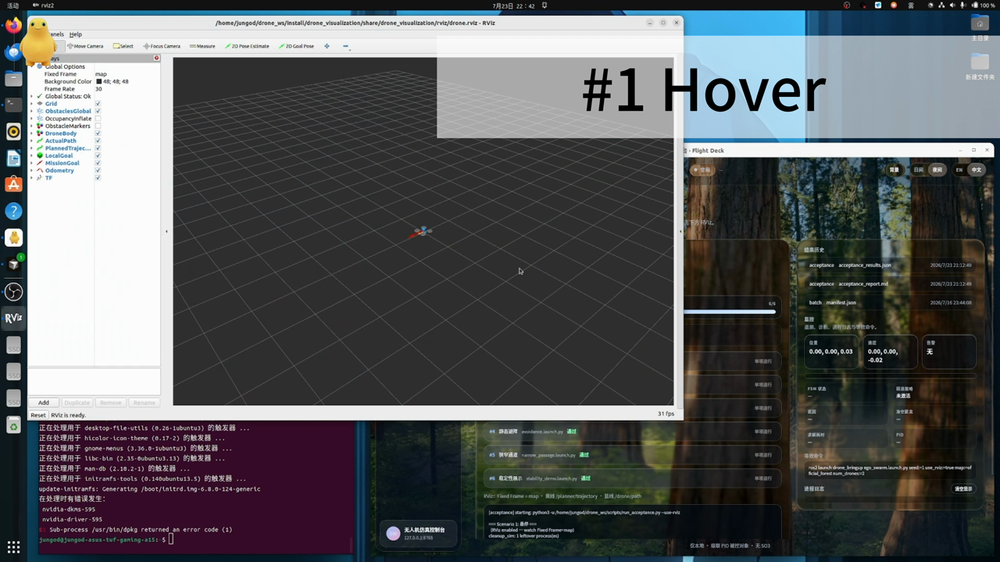

# Anona

### Modular Quadrotor Autonomy Workbench

[](https://docs.ros.org/en/humble/)
[](https://ubuntu.com/)
[](LICENSE)

**English** · [中文版 README](README_zh.md)

> One plant. Many planners. Fair comparison.

---

<!-- Media: drop files into docs/media/ (see docs/media/README.md) -->

<!--  -->
<p align="center">
  <em>Banner placeholder — add <code>docs/media/banner.png</code> (recommended 1600×480)</em>
</p>

<!-- [](docs/media/demo.mp4) -->
<p align="center">
  <em>Demo video placeholder — add <code>docs/media/demo.mp4</code> + <code>demo-poster.png</code></em>
</p>

<!--  -->
<p align="center">
  <em>Animation placeholder — add <code>docs/media/hero-dense-field.gif</code></em>
</p>

---

## Highlights

| | |
|---|---|
| **Unified plant** | Native ROS 2 rigid-body dynamics + cascade PID + mixer — not a thin wrapper around SO3 / MAVROS / fake_drone |
| **Planner matrix** | Six active backends (weak & strong) on the **same** topic contract for fair A/B comparison |
| **Learning stack** | Path H: Polar DrQ-SAC + external VFH safety supervisor; curriculum toward dense-field |
| **Mission Console** | Browser / native Linux app: single & multi-UAV, maps, Start/Stop, onboard RL train cards |
| **Multi-agent** | EGO-Swarm, shared dense field, formation (line / column / V) |
| **Acceptance** | Six one-click scenarios + batch planner×map matrix + reports |

---

## Gallery

Replace placeholders when assets are ready under [`docs/media/`](docs/media/).

| Slot | File | Suggested content |
|------|------|-------------------|
| Architecture | `architecture.png` | Plant ↔ planner contract diagram |
| Console UI | `console-ui.png` / `console-ui.gif` | Mission Console screenshots |
| Dense field | `dense-field.gif` / `.mp4` | Path H in `dense_field` |
| Swarm | `swarm.gif` / `.mp4` | EGO-Swarm or formation |
| RViz | `rviz-overview.png` | Canonical RViz layout |
| Training | `sac-training.gif` | Train-card / eval curve |

---

## What is Anona?

**Anona** (`drone_ws`) is a modular quadrotor simulation workbench on **Ubuntu 22.04 + ROS 2 Humble**.

It separates a **fixed plant** (dynamics + controller) from **swappable planning backends**, so classical search, optimization, and learning planners can be compared under identical actuation, sensing topics, and evaluation scripts.

| Layer | Role | Packages |
|-------|------|----------|
| Plant | Odometry, IMU, motor RPM | `drone_dynamics`, `drone_controller` |
| World | Seeded point-cloud maps | `drone_map`, `map_adapter` |
| Planning | Path A–H backends | `drone_planner`, vendors, `drone_rl_planner`, … |
| Ops | Launch, dashboard, acceptance | `drone_bringup`, `scripts/`, Mission Console |

---

## Planner backends

Canonical registry: [`PLANNERS.md`](src/drone_bringup/PLANNERS.md).

| ID | Backend | Class | Summary |
|----|---------|-------|---------|
| **A** `homemade` | Dyn-A* + B-spline | weak | In-house search baseline |
| **B** `ego` | EGO-Planner | strong | Official-lineage local replanner |
| **C** `gcopter` | GCOPTER / MINCO | strong | Sparse polynomial trajectory |
| **D** `fuel_explore` | Frontier FSM | mode | Exploration mission (not in fair matrix) |
| **E** `mighty` | MIGHTY / Hermite | strong | Adapted strong backend |
| **F** `fast_planner` | Fast-Planner kino | optional | Lineage reference only |
| **G** `vfh` | VFH+ | weak | Reactive histogram; optional PPO train card |
| **H** `sac` | Polar DrQ-SAC | strong | Learning + VFH safety supervisor |

**Fair comparison set:** A / B / C / E / G / H.

```bash
ros2 launch drone_bringup planner_sim.launch.py planner:=sac map:=dense_field
ros2 launch drone_bringup planner_sim.launch.py planner:=ego map:=official_forest
```

Maps catalog: [`MAPS.md`](src/drone_bringup/MAPS.md).

---

## Quick start

### Dependencies

```bash
sudo apt update
sudo apt install -y \
  ros-humble-desktop \
  ros-humble-tf2-ros \
  ros-humble-pcl-conversions \
  libpcl-dev \
  python3-matplotlib \
  python3-numpy
```

### Build

```bash
source /opt/ros/humble/setup.bash
cd ~/drone_ws
export PYTHONNOUSERSITE=1
colcon build --symlink-install
source install/setup.bash
```

### Mission Console

```bash
# Native Linux app
bash packaging/linux/install.sh

# Browser
ros2 run drone_bringup dashboard   # http://127.0.0.1:8765/
```

---

## Scenarios

| # | Scenario | Launch |
|---|----------|--------|
| 1 | Hover | `hover.launch.py` |
| 2 | Single goal | `single_goal.launch.py` |
| 3 | Multi-waypoint | `multi_goal.launch.py` |
| 4 | Static avoidance | `avoidance.launch.py` |
| 5 | Narrow passage | `narrow_passage.launch.py` |
| 6 | Stability (+ wind / IMU noise) | `stability_demo.launch.py` |

---

## Learning · Path H (Polar DrQ-SAC)

Curriculum (easy → medium → denser mixes) and latest stage results:

- English: [`src/drone_rl_planner/CURRICULUM_RESULTS.md`](src/drone_rl_planner/CURRICULUM_RESULTS.md)
- Training how-to: [`src/drone_rl_planner/README.md`](src/drone_rl_planner/README.md)

```bash
cd ~/drone_ws
export PYTHONPATH=src/drone_rl_planner:$PYTHONPATH
# Example: light mix ramp stage
python3 -m drone_rl_planner.train_sac_polar --stage4 --device cuda
```

Checkpoints (`*.pt`) are gitignored. Helpers under `src/drone_rl_planner/checkpoints/`.

---

## Topic contract

| Topic | Type | Role |
|-------|------|------|
| `/drone/motor_rpm_cmd` | `drone_msgs/MotorCommand` | Controller → dynamics |
| `/drone/odom` | `nav_msgs/Odometry` | State |
| `/drone/imu` | `sensor_msgs/Imu` | Sensing |
| `/drone/goal` | `geometry_msgs/PoseStamped` | Mission goal |
| `/map/obstacles` | `sensor_msgs/PointCloud2` | Global obstacles |
| `/planner/local_goal` | `geometry_msgs/PoseStamped` | Rolling local goal |
| `/planner/trajectory_cmd` | `drone_msgs/TrajectoryCommand` | Plant command |
| `/planner/trajectory` | `nav_msgs/Path` | Planned path (RViz) |
| `/planner/status` | `drone_msgs/PlannerStatus` | Planner status |

Frames: `map` (ENU) → `base_link` (x forward, y left, z up).

---

## Repository layout

```
drone_ws/
├── src/                 # Plant, planners, bringup, RL
├── docs/media/          # Screenshots / video / GIFs
├── packaging/           # Native Linux console
├── scripts/             # Goals, eval, acceptance
└── report/              # Acceptance & baseline reports
```

---

## Known issues

1. Dense obstacle nearest-distance in `evaluate.py` can be slow on large maps.
2. Hover metrics need `evaluate.py` / `stability_demo`, not RViz alone.
3. Backend A defaults `enable_bspline_opt: false` for stable dense A* polylines.
4. User setuptools 83+ → set `PYTHONNOUSERSITE=1` before `colcon build`.

---

## License

MIT
