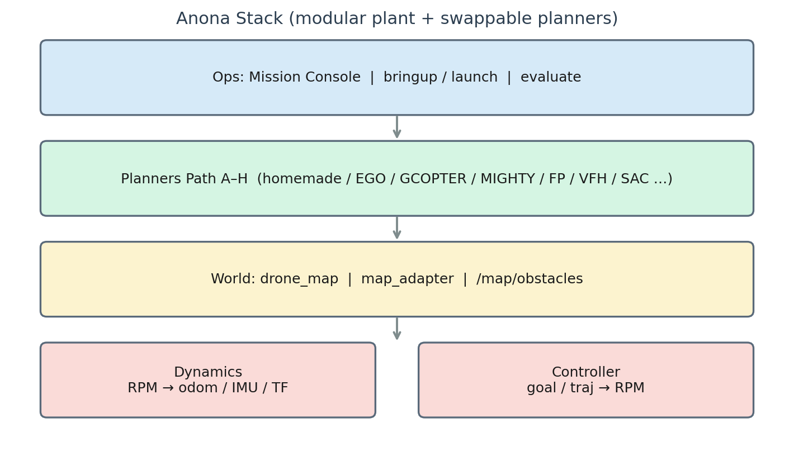
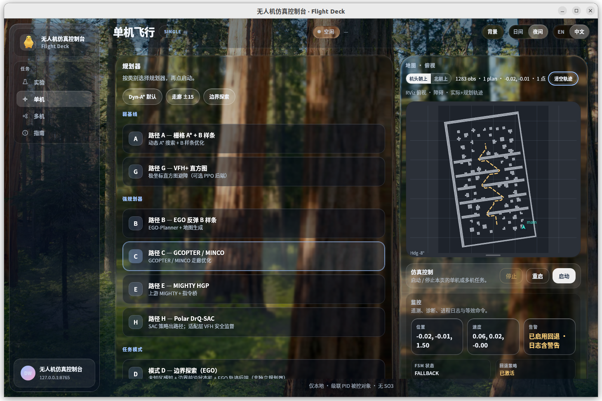
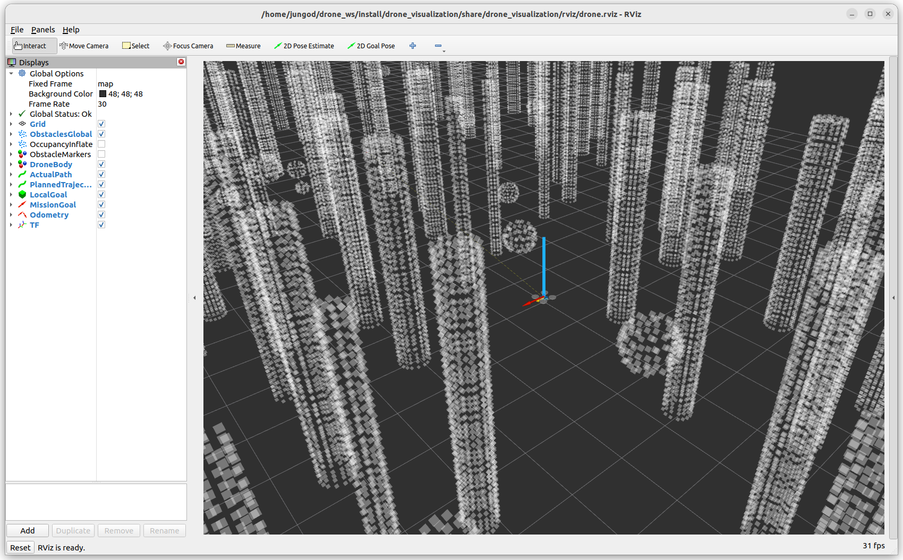
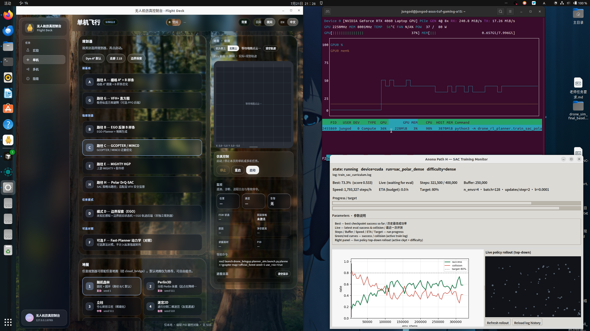
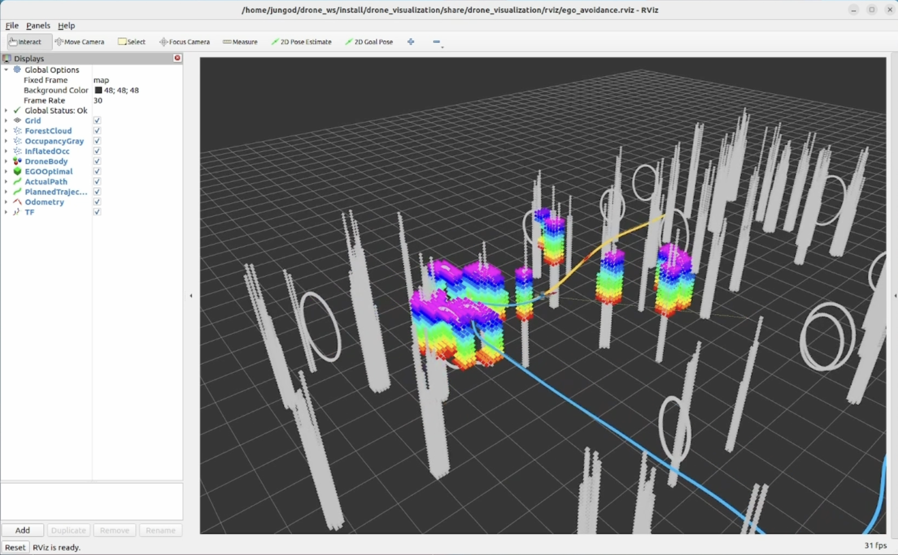
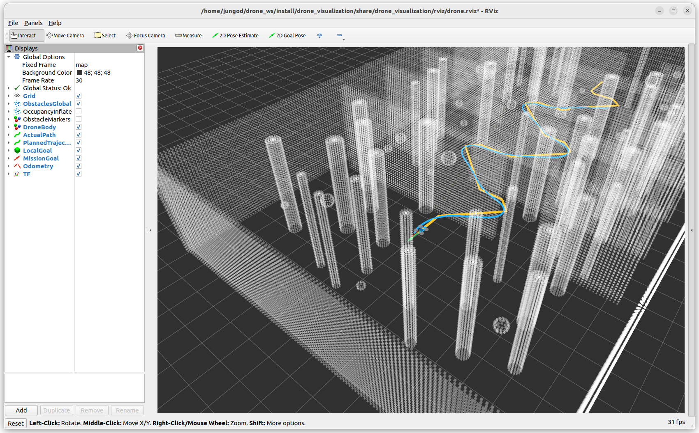

# Anona

### Modular Quadrotor Autonomy Workbench

[](https://docs.ros.org/en/humble/)
[](https://ubuntu.com/)
[](LICENSE)

**English** · [中文版 README](README_zh.md)

> One plant. Many planners. Fair comparison.

---

<p align="center">
  <em>Banner placeholder — optional <code>docs/media/banner.png</code> (recommended 1600×480)</em>
</p>

<p align="center">
  <em>Demo video placeholder — add <code>docs/media/demo.mp4</code> + <code>demo-poster.png</code></em>
</p>

<p align="center">
  
  <br/>
  <em>Single-UAV random-forest loop (animated). Not dense_field.</em>
</p>

---

## Highlights

| | |
|---|---|
| **Unified plant** | Native ROS 2 rigid-body dynamics + cascade PID + mixer — not a thin wrapper around SO3 / MAVROS / fake_drone |
| **Planner matrix** | Six active backends (weak & strong) on the **same** topic contract for fair A/B comparison |
| **Learning stack** | Path H: Polar DrQ-SAC + external VFH safety supervisor; **failed staged success on `dense_field`** (see below) |
| **Mission Console** | Browser / native Linux app: single & multi-UAV, maps, Start/Stop, onboard RL train cards |
| **Multi-agent** | EGO-Swarm, shared dense field, formation (line / column / V) |
| **Acceptance** | Six one-click scenarios (6/6 PASS) + planner×map matrix + [formal report draft](report/final_paper/) |

---

## Gallery

| Slot | File | Status |
|------|------|--------|
| Architecture | [`architecture.png`](docs/media/architecture.png) | Embedded |
| Topic flow | [`topic-dataflow.png`](docs/media/topic-dataflow.png) | Embedded |
| Console | [`console-ui.png`](docs/media/console-ui.png) / [`console-multi.png`](docs/media/console-multi.png) | Embedded |
| Single-UAV demo | [`forest.gif`](docs/media/forest.gif) (random forest; not dense) | Ready |
| Swarm | [`swarm-or-formation.png`](docs/media/swarm-or-formation.png) / [`.gif`](docs/media/swarm-or-formation.gif) | Ready |
| RViz | [`rviz-overview.png`](docs/media/rviz-overview.png) | Embedded |
| Training | [`sac-training.png`](docs/media/sac-training.png) | Static screenshot (not GIF) |
| Scenarios 1–6 | `scenario_0*_*.png` | Ready |
| Demo reel | `demo.mp4` + `demo-poster.png` | **Still missing** |
| Banner | `banner.png` | Optional, missing |

<p align="center">
  
</p>
<p align="center">
  
  &nbsp;
  
</p>
<p align="center">
  
</p>

---

## What is Anona?

**Anona** (`drone_ws`) is a modular quadrotor simulation workbench on **Ubuntu 22.04 + ROS 2 Humble**.

It separates a **fixed plant** (dynamics + controller) from **swappable planning backends**, so classical search, optimization, and learning planners can be compared under identical actuation, sensing topics, and evaluation scripts.

| Layer | Role | Packages |
|-------|------|----------|
| Plant | Odometry, IMU, motor RPM | `drone_dynamics`, `drone_controller` |
| World | Seeded point-cloud maps | `drone_map`, `map_adapter` |
| Planning | Path A–H backends | `drone_planner`, vendors, `drone_rl_planner`, … |
| Ops | Launch, dashboard, acceptance | `drone_bringup`, `scripts/`, Mission Console |

Formal Chinese technical report (LaTeX): [`report/final_paper/`](report/final_paper/) (`main-arxiv.tex`).

---

## Planner backends

Canonical registry: [`PLANNERS.md`](src/drone_bringup/PLANNERS.md).

| ID | Backend | Class | Summary |
|----|---------|-------|---------|
| **A** `homemade` | Dyn-A* + B-spline | weak | In-house search baseline |
| **B** `ego` | EGO-Planner | strong | Official-lineage local replanner |
| **C** `gcopter` | GCOPTER / MINCO | strong | Sparse polynomial trajectory |
| **D** `fuel_explore` | Frontier FSM | mode | Exploration mission (not in fair matrix) |
| **E** `mighty` | MIGHTY / Hermite | strong | Adapted strong backend |
| **F** `fast_planner` | Fast-Planner kino | optional | Lineage reference only |
| **G** `vfh` | VFH+ | weak | Reactive histogram; optional PPO train card |
| **H** `sac` | Polar DrQ-SAC | strong | Learning + VFH safety supervisor |

**Fair comparison set:** A / B / C / E / G / H.

```bash
ros2 launch drone_bringup planner_sim.launch.py planner:=sac map:=official_forest
ros2 launch drone_bringup planner_sim.launch.py planner:=ego map:=official_forest
```

Maps catalog: [`MAPS.md`](src/drone_bringup/MAPS.md).

### Path H / dense_field (honest note)

In the square-mission planner benchmark, Path H (Polar DrQ-SAC) **did not complete staged success on `dense_field` as a policy (FAIL)**. Rows that look “complete” typically end in safety-supervisor `FALLBACK` (VFH takeover) and must not be counted as pure SAC success. The single-UAV loop demo uses **random forest** (`forest.gif` / `official_forest`), **not** the dense field.

Benchmark report: [`report/planner_benchmark/comparison_report.md`](report/planner_benchmark/comparison_report.md).

---

## Quick start

### Dependencies

```bash
sudo apt update
sudo apt install -y \
  ros-humble-desktop \
  ros-humble-tf2-ros \
  ros-humble-pcl-conversions \
  libpcl-dev \
  python3-matplotlib \
  python3-numpy
```

### Build

```bash
source /opt/ros/humble/setup.bash
cd ~/drone_ws
export PYTHONNOUSERSITE=1
colcon build --symlink-install
source install/setup.bash
```

### Mission Console

```bash
# Native Linux app
bash packaging/linux/install.sh

# Browser
ros2 run drone_bringup dashboard   # http://127.0.0.1:8765/
```

---

## Six acceptance scenarios (reproduce)

| # | Scenario | Launch |
|---|----------|--------|
| 1 | Hover | `ros2 launch drone_bringup hover.launch.py` |
| 2 | Single goal | `ros2 launch drone_bringup single_goal.launch.py` |
| 3 | Multi-waypoint | `ros2 launch drone_bringup multi_goal.launch.py` |
| 4 | Static avoidance | `ros2 launch drone_bringup avoidance.launch.py` |
| 5 | Narrow passage | `ros2 launch drone_bringup narrow_passage.launch.py` |
| 6 | Stability | `ros2 launch drone_bringup stability_demo.launch.py` |

```bash
python3 scripts/run_acceptance.py
```

Summary: [`report/acceptance_report.md`](report/acceptance_report.md) (6/6 PASS). Planner matrix: [`report/planner_benchmark/comparison_report.md`](report/planner_benchmark/comparison_report.md).

<p align="center">
  
  &nbsp;
  
</p>

---

## Learning · Path H (Polar DrQ-SAC)

Curriculum (easy → medium → denser mixes) and stage results:

- English: [`src/drone_rl_planner/CURRICULUM_RESULTS.md`](src/drone_rl_planner/CURRICULUM_RESULTS.md)
- Training how-to: [`src/drone_rl_planner/README.md`](src/drone_rl_planner/README.md)

```bash
cd ~/drone_ws
export PYTHONPATH=src/drone_rl_planner:$PYTHONPATH
python3 -m drone_rl_planner.train_sac_polar --stage4 --device cuda
```

Checkpoints (`*.pt`) are gitignored.

---

## Topic contract

| Topic | Type | Role |
|-------|------|------|
| `/drone/motor_rpm_cmd` | `drone_msgs/MotorCommand` | Controller → dynamics |
| `/drone/odom` | `nav_msgs/Odometry` | State |
| `/drone/imu` | `sensor_msgs/Imu` | Sensing |
| `/drone/goal` | `geometry_msgs/PoseStamped` | Mission goal |
| `/map/obstacles` | `sensor_msgs/PointCloud2` | Global obstacles |
| `/planner/local_goal` | `geometry_msgs/PoseStamped` | Rolling local goal |
| `/planner/trajectory_cmd` | `drone_msgs/TrajectoryCommand` | Plant command |
| `/planner/trajectory` | `nav_msgs/Path` | Planned path (RViz) |
| `/planner/status` | `drone_msgs/PlannerStatus` | Planner status |

Frames: `map` (ENU) → `base_link` (x forward, y left, z up).

---

## Open-source citations (selected)

- This repo: <https://github.com/Jungod1121/drone_ws>
- [EGO-Planner Swarm](https://github.com/ZJU-FAST-Lab/ego-planner-swarm)
- [GCOPTER](https://github.com/ZJU-FAST-Lab/GCOPTER)
- [MIGHTY](https://github.com/mit-acl/mighty)
- [Fast-Planner](https://github.com/HKUST-Aerial-Robotics/Fast-Planner)
- [DrQ](https://github.com/denisyarats/drq) / [DrQ-v2](https://github.com/facebookresearch/drqv2)

---

## Repository layout

```
drone_ws/
├── src/                 # Plant, planners, bringup, RL
├── docs/media/          # Screenshots / video / GIFs
├── packaging/           # Native Linux console
├── scripts/             # Goals, eval, acceptance
└── report/              # Acceptance, baseline, formal report draft
```

---

## Known issues

1. Dense obstacle nearest-distance in `evaluate.py` can be slow on large maps.
2. Hover metrics need `evaluate.py` / `stability_demo`, not RViz alone.
3. Backend A defaults `enable_bspline_opt: false` for stable dense A* polylines.
4. User setuptools 83+ → set `PYTHONNOUSERSITE=1` before `colcon build`.
5. Path H **failed** staged success on `dense_field` (see above).

---

## License

MIT
