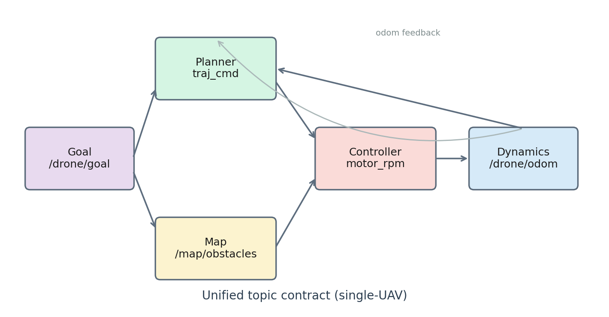

# Anona

### 模块化四旋翼自主仿真工作台

[](https://docs.ros.org/en/humble/)
[](https://ubuntu.com/)
[](LICENSE)

[English README](README.md) · **中文**

> 同一动力学与控制层。多种规划器。公平对照。

<p align="center">
  
</p>
<p align="center">
  
</p>

---

## 亮点

| | |
|---|---|
| **统一动力学与控制层** | 自研 ROS 2 刚体动力学 + 级联 PID + 混控 |
| **多规划器** | Path A–H 共用同一话题契约，便于公平对照 |
| **多样地图** | 过程生成森林、迷宫、密集场、窄通道 |
| **任务控制台** | 浏览器 / 原生应用：地图、规划器、单机与多机 |
| **验收** | 六项一键场景（6/6 PASS）+ [正式报告](report/final_paper/) |

---

<p align="center">
  
  <br/>
  
</p>
<p align="center">
  
  &nbsp;
  
</p>

---

## Anona 是什么？

**Anona** 是运行于 **Ubuntu 22.04 + ROS 2 Humble** 的模块化四旋翼仿真工作台：固定动力学与控制层，可替换规划后端，统一话题与评测脚本。

| 层级 | 作用 | 软件包 |
|------|------|--------|
| 动力学与控制 | 里程计、IMU、电机 RPM | `drone_dynamics`, `drone_controller` |
| 世界 | 可复现点云地图 | `drone_map`, `map_adapter` |
| 规划 | Path A–H | `drone_planner`, vendors, `drone_rl_planner`, … |
| 运维 | 启动、仪表盘、验收 | `drone_bringup`, 任务控制台 |

登记：[`PLANNERS.md`](src/drone_bringup/PLANNERS.md) · 地图：[`MAPS.md`](src/drone_bringup/MAPS.md)

```bash
ros2 launch drone_bringup planner_sim.launch.py planner:=ego map:=official_forest
```

---

## 快速开始

```bash
sudo apt update && sudo apt install -y \
  ros-humble-desktop ros-humble-tf2-ros ros-humble-pcl-conversions \
  libpcl-dev python3-matplotlib python3-numpy

source /opt/ros/humble/setup.bash
cd ~/drone_ws
export PYTHONNOUSERSITE=1
colcon build --symlink-install
source install/setup.bash

# 任务控制台
bash packaging/linux/install.sh          # 原生
ros2 run drone_bringup dashboard         # http://127.0.0.1:8765/
```

---

## 验收（6/6）

| # | 场景 | Launch |
|---|------|--------|
| 1 | 悬停 | `ros2 launch drone_bringup hover.launch.py` |
| 2 | 单目标 | `ros2 launch drone_bringup single_goal.launch.py` |
| 3 | 多航点 | `ros2 launch drone_bringup multi_goal.launch.py` |
| 4 | 静态避障 | `ros2 launch drone_bringup avoidance.launch.py` |
| 5 | 窄通道 | `ros2 launch drone_bringup narrow_passage.launch.py` |
| 6 | 稳定性 | `ros2 launch drone_bringup stability_demo.launch.py` |

```bash
python3 scripts/run_acceptance.py
```

<p align="center">
  
  &nbsp;
  
</p>

报告：[`report/acceptance_report.md`](report/acceptance_report.md) · 对照：[`report/planner_benchmark/comparison_report.md`](report/planner_benchmark/comparison_report.md)

---

## 话题契约

| Topic | 作用 |
|-------|------|
| `/drone/goal` | 任务目标 |
| `/map/obstacles` | 障碍点云 |
| `/planner/local_goal`, `/planner/trajectory_cmd` | 规划 → 控制层 |
| `/drone/motor_rpm_cmd` | 控制器 → 动力学 |
| `/drone/odom` | 状态反馈 |

坐标系：`map`（ENU）→ `base_link`。

---

## 引用

- 本仓：<https://github.com/Jungod1121/Anona-Modular-Quadrotor-Autonomy>
- [EGO-Planner Swarm](https://github.com/ZJU-FAST-Lab/ego-planner-swarm) · [GCOPTER](https://github.com/ZJU-FAST-Lab/GCOPTER) · [MIGHTY](https://github.com/mit-acl/mighty) · [Fast-Planner](https://github.com/HKUST-Aerial-Robotics/Fast-Planner) · [DrQ](https://github.com/denisyarats/drq) / [DrQ-v2](https://github.com/facebookresearch/drqv2)

## License

MIT
