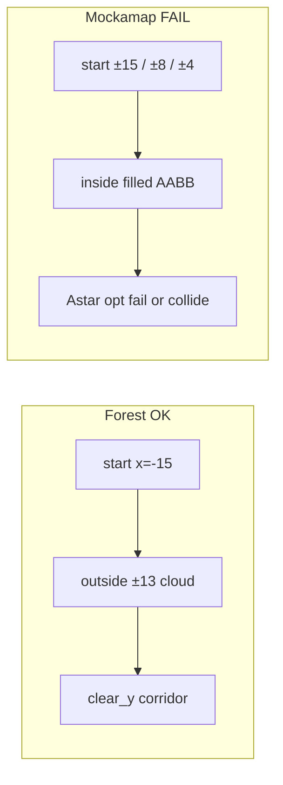

# Map Fit, Bugs, RViz Goals, Apple Dashboard

## Bug A — Homemade maps cannot stick in dashboard

**Cause:** [`app.js`](src/drone_bringup/drone_bringup/dashboard_static/app.js) `selectMulti` forces any non-`official*` map to `official_forest` whenever `multiMode === 'ego_swarm'`. Default `multiMode` is `ego_swarm` even in **single** mode, and the 1 Hz `/api/status` poll re-calls `selectMulti` → selection resets every second.

**Fix:** Gate the force:

```javascript
if (state.mode === 'multi' && key === 'ego_swarm' && !String(state.map).startsWith('official')) {
  state.map = 'official_forest';
  selectMap(state.map, false);
}
```

Launch/`map_stack` already accept homemade for Path A/B/C — no server-side block.

---

## Bug B — Only blue path in RViz (yellow missing)

| Color | Topic | Meaning |
|-------|-------|---------|
| Blue | `/drone/path` | flown path (ActualPath) |
| Yellow | `/planner/trajectory` | planned path (PlannedTrajectory) |

**Cause (Path B):** EGO `planning_visualization.cpp` hardcodes Marker `frame_id = "world"`, while our RViz Fixed Frame is **`map`** (no `world` TF) → `optimal_list` invisible. Bridge then falls back to `pos_cmd` breadcrumbs ≈ flown path → yellow looks like blue / empty ahead.

**Fix:**

1. In [`planning_visualization.cpp`](src/ego_vendor/traj_utils/src/planning_visualization.cpp): `"world"` → `"map"` (`displayMarkerList`, `displayGoalPoint`).
2. Optionally drop `get_subscription_count()==0` early-return on `optimal_list` so publishers do not skip when RViz connects late.
3. Rebuild `traj_utils` / ego stack; confirm `/planner/trajectory` has ahead-of-drone poses.

Homemade Path A still publishes yellow from `planner_node` when `traj_` non-empty — separate from this EGO frame bug.

---

## Root causes (why mockamap avoidance fails)

`official_forest` works because start is **outside** the obstacle box (`x=-15` vs forest ±13) and forest has `clear_y=1.6`. Mockamap fills the **entire** AABB; catalog reuses forest/maze poses that put the drone **inside** dense voxels:

| Map | Obstacle AABB | Current pose | Main failure |
|-----|---------------|--------------|--------------|
| `official_perlin` | ±20×±10 | ±15 inside fill | start in cloud |
| `official_posts` | ±5×±5, 50 pillars | ±4 inside | start in pillars |
| `official_maze2d` | ±10, `road_width=0.5` | ±8 | corridor tighter than inflate/`dist0` |
| `official_maze3d` | XY ±10; **Z centered** `[-z/2,z/2]` | z=1 | half map below z=0 never in planner; passages tight |

Official EGO: RViz **2D Goal Pose** only; [`waypointCallback`](src/ego_vendor/ego_planner/src/ego_replan_fsm.cpp) takes XY then **hardcodes `z=1.0`**.



---

## 1. Per-map pose + density (Path A/B/C)

**Files:** [`maps_catalog.py`](src/drone_bringup/drone_bringup/maps_catalog.py), [`launch_utils.py`](src/drone_bringup/drone_bringup/launch_utils.py), Path A bounds, Path B inflation/`dist0`, Path C `DilateRadius` / `MapBound`.

**Defaults:**

- **`official_perlin`**: `50×26×5`, `fill=0.05`, `complexity=0.05`; pose `init=(-22,0,1)`, `goal=(22,0,1)`.
- **`official_posts`**: box `20×20×4`, `obstacle_number=12`; pose `init=(-8,0,1)`, `goal=(8,0,1)`.
- **`official_maze2d`**: `road_width=1.2`; pose `init=(-9,0,1)`, `goal=(9,0,1)`; Path B inflate `≤0.05`, `dist0≈0.25`; Path C Dilate `≈0.15`.
- **`official_maze3d`**: pose `z=0`, widen passages (`roadRad`/`nodeRad`), align Z with planner occupancy `[0, z]`.
- **Path A:** expand `map_origin`/`map_size` so official poses fall inside homemade grid.

Update [`MAPS.md`](src/drone_bringup/MAPS.md) with AABB vs start/goal.

---

## 2. Goals: RViz-first, height = cruise_height

Keep native **2D Goal Pose**; height = `cruise_height` (default `1.0`). No web Send Goal. Interactive Marker XYZ out of scope.

| Path | Change |
|------|--------|
| **B** | `waypointCallback`: if `msg.z > 0.1` use it, else `fsm/cruise_height`. |
| **A / C** | Same floor when RViz sends z≈0. |
| **Dashboard** | Remove Send Goal; hint to use RViz. |

---

## 3. Apple-white dashboard restyle

[`style.css`](src/drone_bringup/drone_bringup/dashboard_static/style.css) (+ light HTML/JS structure if needed): `#fbfbfd` canvas, `#1d1d1f` text, accent `#0071e3`, `-apple-system` stack, hairline dividers; remove dark teal/amber/grain. Keep controls; strip Goal block.

---

## Implementation order

1. **Bug A** map select gate + **Bug B** EGO viz `world`→`map` (quick user-facing wins).
2. Catalog poses + mockamap density + Path A/B/C maze/clearance params.
3. `cruise_height` + remove dashboard Send Goal.
4. Apple-white CSS.
5. Docs + smoke: homemade select sticks; yellow Path ahead of drone; four mockamap types Path B.
