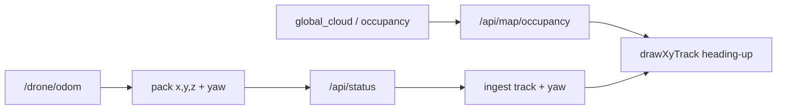

# Fix map: obstacles, layout, ratio, heading-up

## What you mean (confirmed)

1. **Obstacles + track missing** — restore them.
2. **Sidebar vs main** — left rail and main content stay side-by-side; resizing/narrowing must not stack the rail on top and shove the main UI down.
3. **Adjustable map ratio** — drop the locked square; user can change map height/aspect.
4. **Map rotates with drone** — **heading-up**: world rotates under a fixed “nose up” drone marker (car-GPS style).

## 1. Restore obstacles and tracks

Root cause for empty obstacles: [`dashboard_server.py`](src/drone_bringup/drone_bringup/dashboard_server.py) `_on_obstacle_cloud` uses `math.ceil` / `math.sqrt` / `math.floor` but **`math` is never imported at module level** → cloud projection throws, occupancy stays null/weak.

- Add `import math` at top of [`dashboard_server.py`](src/drone_bringup/drone_bringup/dashboard_server.py).
- Keep existing subscribers (`/map_generator/global_cloud`, `/map/obstacles`, `/map/occupancy_topdown`, `/map/occupancy`).
- Expose **yaw** in `_pack_odom` from pose quaternion (`atan2(2(wz+xy), 1-2(y²+z²))`) so tracks can drive rotation.
- Frontend: keep ingesting x/y into `xyTrack.series`; also store latest `yaw` per id; ensure Start/Stop still clears track; redraw when occupancy or status updates.
- Sync install after change so the desktop app is not stuck on old code.

## 2. Sidebar and main move independently

Today [`style.css`](src/drone_bringup/drone_bringup/dashboard_static/style.css) `@media (max-width: 1100px)` forces:

- `.shell` → single column (rail **above** main → main “slides down”)
- `.page-split` → single column (map under form)

**Change:**

- Keep `.shell` as `rail | main` at all practical widths (no vertical stack). Narrow windows: shrink `--rail-w`, rail scrolls internally if needed; main scrolls alone (`overflow` on `.app-main` / `.workspace`).
- Keep `.page-split` as two columns; only stack map under form below a much smaller phone breakpoint if needed.
- Add a thin **drag handle** between `.page-split` columns so the map column width can be adjusted without moving the left rail or collapsing the form downward.

## 3. Adjustable map aspect ratio

In [`style.css`](src/drone_bringup/drone_bringup/dashboard_static/style.css) `.xy-track__stage`:

- Remove `aspect-ratio: 1 / 1` and `max-width: 420px` lock.
- Stage fills map column width; default height ~320px; bottom-edge **resize handle** to change height (aspect follows width×height).
- In [`app.js`](src/drone_bringup/drone_bringup/dashboard_static/app.js) `drawXyTrack` / `worldBounds`: stop forcing a square world span; scale X and Y independently (or fit with independent padding) so a non-square canvas is used fully.

## 4. Heading-up map rotation

In `drawXyTrack`:

- Anchor on latest pose for active drone (`main` or selected swarm id).
- Transform: translate so drone is near canvas center → rotate by **`-yaw`** so nose points up → draw obstacles + track in that frame.
- Draw a fixed triangle/chevron at center for the drone (does not rotate).
- Multi: rotate around primary drone; other drones’ tracks drawn in the same rotated frame.
- Small HUD toggle **Heading / North** (default Heading) for debugging if needed.

## Files to touch

- [`src/drone_bringup/drone_bringup/dashboard_server.py`](src/drone_bringup/drone_bringup/dashboard_server.py) — `import math`, yaw in `_pack_odom`
- [`src/drone_bringup/drone_bringup/dashboard_static/app.js`](src/drone_bringup/drone_bringup/dashboard_static/app.js) — heading-up draw, resizable stage, yaw ingest
- [`src/drone_bringup/drone_bringup/dashboard_static/style.css`](src/drone_bringup/drone_bringup/dashboard_static/style.css) — layout independence, map resize, drop square lock
- [`src/drone_bringup/drone_bringup/dashboard_static/index.html`](src/drone_bringup/drone_bringup/dashboard_static/index.html) — resize handle + Heading/North control if needed
- Sync to `install/.../drone_bringup/` after build so `drone-ws-console` picks it up

## Verify

1. Restart console; Start a single-drone forest mission.
2. `/api/map/occupancy` returns `ok: true` with non-empty `occupied`.
3. Track polyline appears; map rotates as yaw changes; drone marker stays nose-up.
4. Drag left rail area / narrow window: main stays beside rail (no vertical shove).
5. Drag map height handle: aspect changes; obstacles/track still draw correctly.
