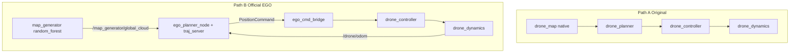

# Dual Path: Keep Original Planner + Official EGO (+ Official Map)

## Goals (locked)

1. **Keep original planner** — do not delete or gut [`src/drone_planner`](src/drone_planner). Existing launches (`hover`, `single_goal`, `avoidance` with homemade planner, multi-drone, formation) stay available.
2. **Official EGO planner package** — run real `ego_planner` / `traj_server` from [`src/ego_vendor`](src/ego_vendor), bridged to **our** `drone_controller` + `drone_dynamics` (no SO3 / fake_drone).
3. **Official EGO map** — use upstream `map_generator` (`random_forest`) from the ego-planner-swarm tree (not only our `dense_field` / `ego_dense_forest` ports).

## Path A — original (unchanged intent)

- Leave [`drone_planner`](src/drone_planner), [`avoidance.launch.py`](src/drone_bringup/launch/avoidance.launch.py) (homemade), and other scenes as-is.
- Only soft safety: default [`planner.yaml`](src/drone_bringup/config/planner.yaml) `enable_bspline_opt: false` so homemade avoidance uses the previously stable dense A* polyline (no yellow chopping). B-spline code remains in tree; can re-enable by param.
- Document in README: **Path A** = our planner; **Path B** = official EGO.

## Path B — official EGO + official map + our plant

### 1. Vendor official map packages
- Copy into `src/ego_vendor/` from [`reference_repos/ego-planner-swarm/src/uav_simulator/map_generator`](reference_repos/ego-planner-swarm/src/uav_simulator/map_generator) (and `mockamap` if build is cheap / already ROS2).
- Do **not** vendor `so3_control`, `fake_drone`, or `so3_quadrotor_simulator`.
- Build: `colcon build --packages-up-to map_generator ego_planner drone_bringup`.

### 2. Rework [`ego_avoidance.launch.py`](src/drone_bringup/launch/ego_avoidance.launch.py)
- **Replace** `map_node('map_dense.yaml')` with official `map_generator`/`random_forest` node (params from EGO `single_run_in_sim.launch.py`: map size, obstacle density, seed).
- Remap EGO cloud input: `grid_map/cloud` ← `/map_generator/global_cloud` (latched PointCloud2).
- Keep: `dynamics_node`, `controller_node`, `ego_planner_node`, `traj_server`, [`ego_cmd_bridge`](src/drone_bringup/drone_bringup/ego_cmd_bridge.py), RViz, `send_goal` → `/move_base_simple/goal`.
- Align init pose / map bounds so start and goal sit in free space (match EGO defaults or set `init_x/y/z` next to forest clearance).

### 3. Fix the current smoke-test failures
From prior runs: intermittent **no TRIG** (goal not absorbed) and then **`a star error, force return!`** during REPLAN.

- Goal: ensure QoS/reliability matches EGO's `/move_base_simple/goal` subscription (volatile/reliable); delay goal until after odom + first cloud (e.g. 5–7 s); optionally republish goal once via bridge.
- Map/planner: enlarge `grid_map/local_update_range_*` so full forest is visible; lower `obstacles_inflation` if A* fails; set `fsm/thresh_replan_time` higher to cut REPLAN thrash.
- Bridge: keep publishing `/planner/local_goal` + `/planner/trajectory_cmd`; for yellow path prefer EGO markers (`/drone_0_plan_vis/optimal_list`) in RViz rather than chopping `pos_cmd` trail.

### 4. README
- Path A: `ros2 launch drone_bringup avoidance.launch.py` (our planner + our map).
- Path B: `ros2 launch drone_bringup ego_avoidance.launch.py` (official EGO planner + official map_generator + our controller/dynamics).

## Explicit non-goals
- Do not delete homemade planner or replace core six-scenario path with EGO only.
- Do not run official SO3 / fake_drone as the plant.
- Do not spend more time retuning homemade B-spline for Path B.

## Success
- Path A still launches and plans with `drone_planner`.
- Path B: official `random_forest` cloud + EGO FSM reaches `EXEC_TRAJ` without stuck `WAIT_TARGET` / endless `a star error`, drone tracks with our PID.
