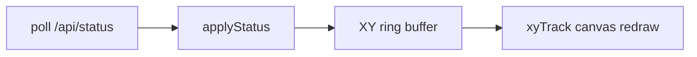

# Revert CSS glass + add XY track panel

## Goals
1. Drop the broken WebGL LiquidGlass experiment; restore **CSS frosted glass** + night photo ambiance.
2. Add a **single 2D top-down (XY) trajectory** feature that appears on every page, without changing planners, RViz, or other flows.

## A. Revert glass to original CSS look

Touch mainly:
- [index.html](src/drone_bringup/drone_bringup/dashboard_static/index.html)
- [style.css](src/drone_bringup/drone_bringup/dashboard_static/style.css)
- [liquid-boot.js](src/drone_bringup/drone_bringup/dashboard_static/liquid-boot.js) / [app.js](src/drone_bringup/drone_bringup/dashboard_static/app.js)

Changes:
- Remove `liquid-boot.js` script tag and all `DroneLiquidGlass.refresh` calls from `app.js`.
- Remove every `.page-scene` / `page-scene__photo` block and LiquidGlass `data-config` attributes.
- Keep night art as one fixed CSS layer on `.app-bg` (`background-image: url(/bg-night.png)` + light veil).
- Panels stay `.surface` / `.home-card` with existing `backdrop-filter` frosted CSS (no `lg-live`, no transparent WebGL override).
- Leave vendored `vendor/liquidglass/` unused (no need to delete in this pass).

## B. XY top-down track (new single feature)

**Data (already exists):** `/api/status` returns latest `odom.{x,y,z,...}` and `swarm_odom.uavN.{x,y,...}` — no history today. Poll is ~1 Hz in `app.js`.

**Client-side history (no ROS/API change required):**
- In `app.js`, keep a ring buffer of XY samples (e.g. last ~800 points / ~13 min at 1 Hz).
- On each `applyStatus`: if `odom` present, push `{x,y}` when moved enough (e.g. >0.05 m) to avoid duplicates.
- In multi mode, also append per-`uav*` series from `swarm_odom` (distinct colors). Single mode uses main `odom` only.
- Clear buffer on **Start** / **Restart** (new run), plus a small “清空轨迹” button on the panel.

**UI widget (one shared panel, docked on every page):**
- Add a reusable block in HTML, e.g. `#xyTrackPanel` with a `<canvas>` (or SVG), title “俯视轨迹 XY”, live coords, clear button.
- Mount it similarly to `mapPanel` / sticky side: visible on **home / single / multi / lab / train / monitor** (same widget moved or fixed in workspace footer/side so it does not rewrite each page’s main controls).
- Draw: auto-fit bounds with padding, grid, path polyline(s), current position marker; **Z ignored** (top-down).

**Files to add/change:**
- [app.js](src/drone_bringup/drone_bringup/dashboard_static/app.js) — buffer + draw + clear hooks
- [index.html](src/drone_bringup/drone_bringup/dashboard_static/index.html) — track panel markup
- [style.css](src/drone_bringup/drone_bringup/dashboard_static/style.css) — compact track panel layout
- Optional tiny i18n strings in `app.js` (`trackTitle`, `trackClear`, …)

## Out of scope
- No RViz / planner changes
- No server-side trajectory storage
- No 3D view

## Verify
- Hard-refresh dashboard: no WebGL glass; CSS frost + night bg look normal.
- Start a sim, watch XY path grow on every page; clear resets; multi shows multiple colored paths when swarm odom is present.
