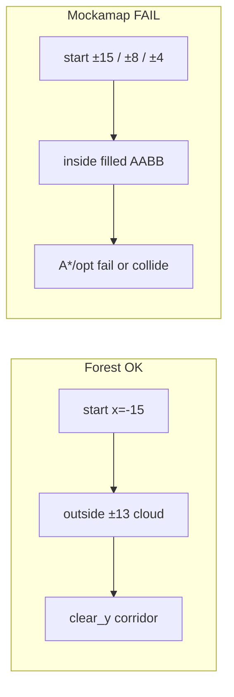

# Map Fit, RViz Goals, Apple Dashboard

## Root causes (why mockamap fails)

`official_forest` works because start is **outside** the obstacle box (`x=-15` vs forest ±13) and forest has `clear_y=1.6`. Mockamap fills the **entire** AABB; catalog reuses forest/maze poses that put the drone **inside** dense voxels:

| Map | Obstacle AABB | Current pose | Main failure |
|-----|---------------|--------------|--------------|
| `official_perlin` | ±20×±10 | ±15 inside fill | start in cloud |
| `official_posts` | ±5×±5, 50 pillars | ±4 inside | start in pillars |
| `official_maze2d` | ±10, `road_width=0.5` | ±8 | corridor tighter than inflate/`dist0` |
| `official_maze3d` | XY ±10; **Z centered** `[-z/2,z/2]` | z=1 | half map below z=0 never in planner; passages tight |

Official EGO: RViz **2D Goal Pose** only; [`waypointCallback`](src/ego_vendor/ego_planner/src/ego_replan_fsm.cpp) takes XY then **hardcodes `z=1.0`** (ignores message z except reject if `z < -0.1`).

---

## 1. Per-map pose + density (Path A/B/C)

**Files:** [`maps_catalog.py`](src/drone_bringup/drone_bringup/maps_catalog.py), [`launch_utils.py`](src/drone_bringup/drone_bringup/launch_utils.py) (`_mockamap_node`, `_random_forest_node`, planner pose injection), Path A map bounds in [`planner.yaml`](src/drone_bringup/config/planner.yaml) / launch overrides, Path B inflation/`dist0` overrides, Path C `DilateRadius` / `MapBound` for maze.

**Concrete defaults (commit to these):**

- **`official_perlin`**: enlarge to `50×26×5`, `fill=0.05`, `complexity=0.05`; pose `init=(-22,0,1)`, `goal=(22,0,1)` (outside pattern like forest).
- **`official_posts`**: box `20×20×4`, `obstacle_number=12`; pose `init=(-8,0,1)`, `goal=(8,0,1)`.
- **`official_maze2d`**: `road_width=1.2`; pose edge `init=(-9,0,1)`, `goal=(9,0,1)`; Path B for this map: `obstacles_inflation≤0.05`, `dist0≈0.25`; Path C: `DilateRadius≈0.15`.
- **`official_maze3d`**: align Z to `[0,z]` behavior for planners — either bump generator use toward non-negative Z (prefer shifting init/goal to `z=0` and raise planner floor awareness) **or** set `z_length=4` + pose `z=0` and widen `roadRad`/`nodeRad` (e.g. 8/5); verify free cells before declaring pass.
- **Path A:** expand `map_origin`/`map_size` (or per-map overrides) so official poses fall **inside** the homemade grid (today origin `(-2,-2)` size `24×14` cannot cover ±15/±22).

Also update [`MAPS.md`](src/drone_bringup/MAPS.md) with AABB vs start/goal diagram per type.

**Verify:** for each map id, one Path B smoke: start free → click goal → `EXEC_TRAJ` without immediate collision; spot-check Path A/C once on maze2d + perlin.

---

## 2. Goals: RViz-first, “3D” as cruise height

**Decision (matches your RViz habit + official UX):** keep native **2D Goal Pose**; height = launch/param `cruise_height` (default `1.0`). No web Send Goal. True drag-XYZ Interactive Marker is **out of scope** this pass.

| Path | Change |
|------|--------|
| **B** | Patch `waypointCallback`: if `msg.z > 0.1` use it, else use param `fsm/cruise_height` (default 1.0). Wire param in ego launches. |
| **A / C** | Already use message z; when RViz sends z≈0, apply same `cruise_height` floor in goal handling / bridge. |
| **RViz** | Keep SetGoal → `/drone/goal` (swarm: `/uav0/drone/goal`). Toolbar stays 2D Goal Pose; document that height comes from `cruise_height`. |
| **Dashboard** | Remove Send Goal button + related API/i18n; optional tiny read-only hint: “Set goals in RViz (2D); altitude = cruise_height”. |

Docs one-liner in README/PLANNERS: official = 2D + fixed 1.0; ours = 2D + tunable `cruise_height`.

---

## 3. Apple-white dashboard restyle

**Files:** [`dashboard_static/style.css`](src/drone_bringup/drone_bringup/dashboard_static/style.css), light tweaks to [`index.html`](src/drone_bringup/drone_bringup/dashboard_static/index.html) / [`app.js`](src/drone_bringup/drone_bringup/dashboard_static/app.js) (structure only if needed).

**Look (locked):**
- White / light-gray canvas (`#fbfbfd` / `#f5f5f7`), near-black text (`#1d1d1f`), single accent (system blue `#0071e3` for primary CTA only).
- Typography: `-apple-system, BlinkMacSystemFont, "SF Pro Text", "Helvetica Neue", sans-serif` — large, airy margins, thin hairline dividers (no instrument-dark teal/amber, no grain/glow).
- Controls: minimal pills/buttons, soft gray inactive states; process cards as quiet groups not dark “panels”.
- Keep EN/中文, Start/Stop/Restart, map select, multi-mode, live odom, logs — strip visual noise and the Goal block.

---

## Implementation order

1. Catalog poses + mockamap density/size + Path A bounds + Path B/C tighten params for maze.
2. EGO `cruise_height` + goal z floor for A/C; remove dashboard Send Goal.
3. Apple-white CSS restyle.
4. Doc pass (`MAPS.md` + short goal note) + smoke on four mockamap types Path B.
