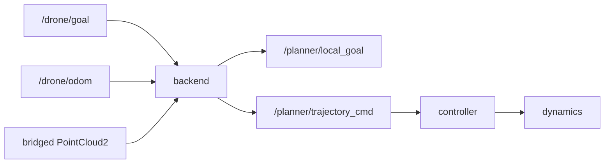

# Modular integration of MIGHTY / GCOPTER refresh / Fast-Planner

## Feasibility verdict

**Yes.** The workspace already modularizes *planner backend × map × (single/multi)*. New algorithms plug in by satisfying the stable contract in [`PLANNERS.md`](src/drone_bringup/PLANNERS.md)—same plant (`drone_dynamics` + `drone_controller`), same goals/odom, cloud via [`cloud_bridge`](src/drone_bringup/drone_bringup/cloud_bridge.py)—without changing the plant.

Caveats vs the marketing blurbs:

| Candidate | Reality vs claim | Integration style |
|-----------|------------------|-------------------|
| **MIGHTY** ([mit-acl/mighty](https://github.com/mit-acl/mighty)) | Real Humble C++ planner; **not** “Eigen+PCL only”—needs **DecompROS2**, **dynus_interfaces**, mapping utils; ship Gazebo/Livox as *optional* and strip them | Vendor core + **bridge** (`dynus` State/Goal/Traj → our odom/goal/`TrajectoryCommand`) — like Path B |
| **GCOPTER “gcopter_ros2”** | URL `yuwei-wu/gcopter_ros2` **404**. Correct source is already vendored: [`yuwei-wu/GCOPTER` `ros2`](https://github.com/yuwei-wu/GCOPTER/tree/ros2) → [`gcopter_vendor`](src/gcopter_vendor/gcopter/) ([`VENDOR_NOTES.md`](src/gcopter_vendor/gcopter/VENDOR_NOTES.md)) | **Upgrade Path C in place** (diff upstream, keep plant pubs); not a new Path ID |
| **Fast-Planner** (`LiHaojie07/fast_planner_ros2`) | Repo **404**. Use a maintained ROS2 port (e.g. [RohitPawar2406/Fast-Planner-ROS2](https://github.com/RohitPawar2406/Fast-Planner-ROS2), Foxy→Humble bring-up) or port ROS1 `plan_manage` ourselves | Vendor + **PositionCommand-style bridge** (reuse/adapt `ego_cmd_bridge`) |

**Chosen numbering (concrete):** keep A–D; refresh **C**; add **Path E = MIGHTY**; add **Path F = Fast-Planner (kino)**. Do **not** replace C with MIGHTY—students can A/B-compare MINCO vs Hermite.

**Chosen order:** Phase 1 Path C refresh → Phase 2 Path E MIGHTY → Phase 3 Path F Fast-Planner (hardest bring-up / deps).

---

## Shared wiring (every new backend)

1. Vendor under `src/<name>_vendor/` (or refresh `gcopter_vendor`); **no SO3 / fake_drone**.
2. Launch `*_avoidance.launch.py`: `map_stack` + dynamics + controller (`use_drone_goal_fallback: false`) + planner (+ bridge) + viz.
3. Register in [`planner_sim.launch.py`](src/drone_bringup/launch/planner_sim.launch.py), [`dashboard_server.py` `PLANNERS`](src/drone_bringup/drone_bringup/dashboard_server.py), [`maps_catalog.py`](src/drone_bringup/drone_bringup/maps_catalog.py) (`DEFAULT_MAP_BY_PLANNER` + optional overrides), [`app.js`](src/drone_bringup/drone_bringup/dashboard_static/app.js) i18n cards, [`PLANNERS.md`](src/drone_bringup/PLANNERS.md) / README.
4. Smoke: extend `scripts/smoke_maps_planners.py`; forest + one maze; confirm yellow `/planner/trajectory` and plant tracking.

---

## Phase 1 — Path C GCOPTER refresh

- Diff current tree vs upstream `yuwei-wu/GCOPTER@ros2`; pull bugfixes / PointCloud handling that don’t break plant pubs.
- Preserve workspace patches: voxel A* (no OMPL), `/drone/odom`, direct `/planner/*` ([`global_planning.cpp`](src/gcopter_vendor/gcopter/src/global_planning.cpp)).
- Update `VENDOR_NOTES.md` with upstream commit hash.
- Acceptance: existing Path C forest / maze2d still plan (no plant change).

---

## Phase 2 — Path E MIGHTY

- Sparse-checkout / submodule **mighty planner packages only**; vendor `decomp_util` + `dynus_interfaces` (minimal msgs); **ignore** Gazebo/Livox/realsense stacks.
- Implement `mighty_cmd_bridge` (or thin C++ remap):
  - in: `/drone/odom`, `/drone/goal`, `/map_generator/global_cloud`
  - out: `/planner/local_goal`, `/planner/trajectory_cmd`, `/planner/trajectory`
- Launch `mighty_avoidance.launch.py`; dashboard ID `mighty`; default map `official_forest`.
- Document DecompROS build steps in `VENDOR_NOTES` / README.

---

## Phase 3 — Path F Fast-Planner

- Vendor kino-replan stack (`plan_env`, `path_searching`, `bspline*`, `plan_manage`); drop their UAV sim; remap cloud/odom/goal.
- Bridge `quadrotor_msgs/PositionCommand` (or port equivalent) → plant via adapted [`ego_cmd_bridge`](src/drone_bringup/drone_bringup/ego_cmd_bridge.py) or shared `position_cmd_bridge`.
- Apt deps: `libnlopt-dev`, `libarmadillo-dev` (document in README).
- Launch `fast_planner_avoidance.launch.py`; dashboard ID `fast_planner`; note denser kinodynamic tracking vs EGO.

---

## Out of scope (this epic)

- Multi/swarm for MIGHTY/Fast-Planner (single-agent first; EGO-Swarm stays Path B multi).
- Collision hard-freeze policy (separate discussion).
- Replacing Path A or removing current GCOPTER.

---

## Risk notes

- **MIGHTY** is the highest integration cost despite best paper upside (Decomp + custom msgs).
- **Fast-Planner** ports are uneven (Foxy heritage); budget time for Humble compile + map frame bugs.
- **GCOPTER “new repo”** is mostly an upstream sync, not a third vendor tree.
