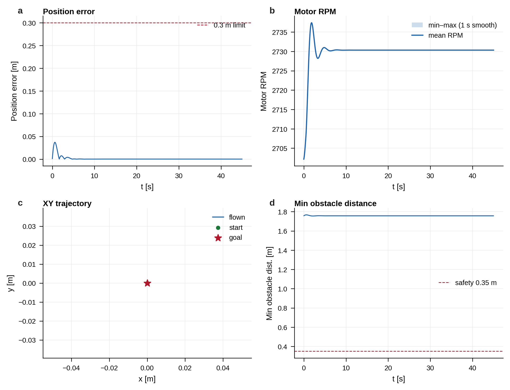
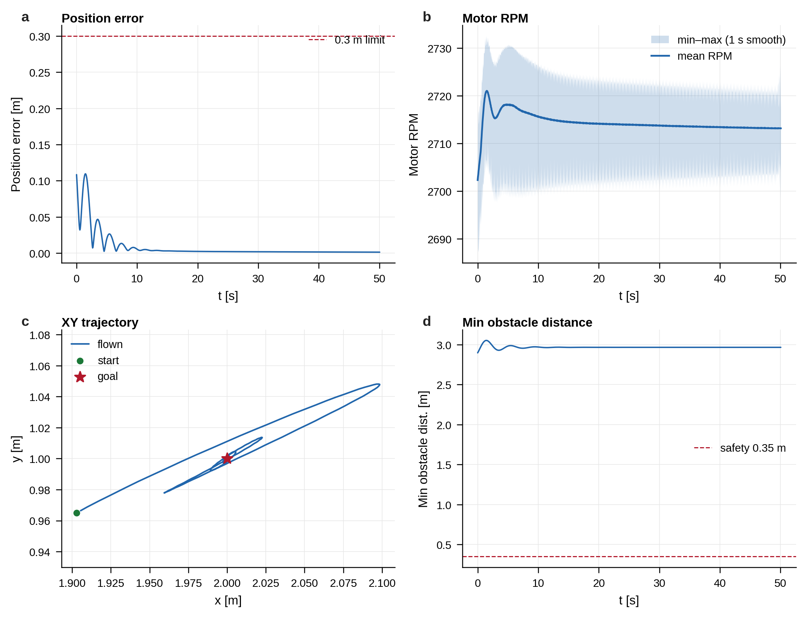
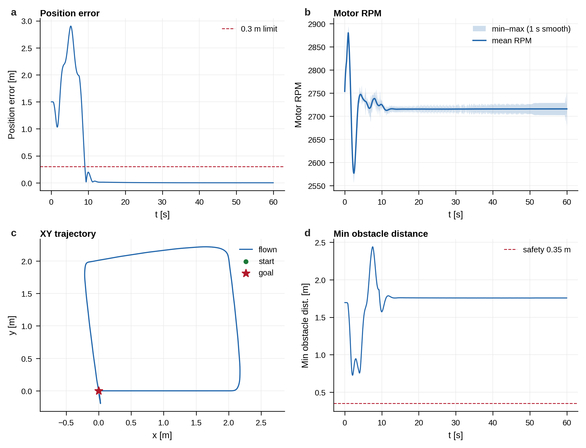
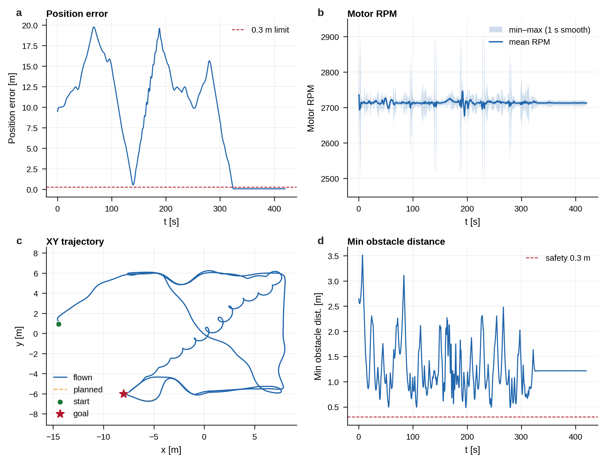
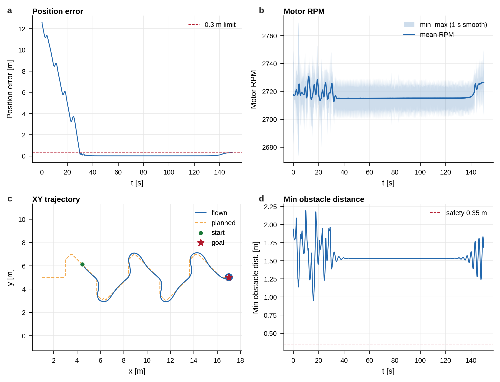
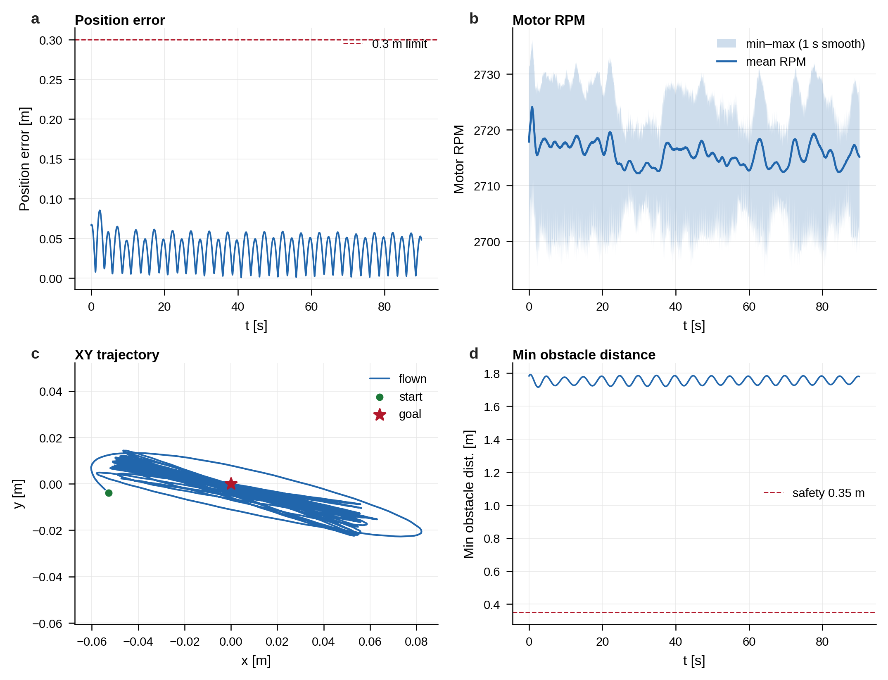

# PLAN.md 验收对照表

> 自动生成时间：2026-08-25 16:30:04 CST
> 通过：**6/6** 场景

## 总览

| # | 场景 | launch | 结果 | 关键指标 |
|---|------|--------|------|----------|
| 1 | 悬停 | `hover.launch.py` | ✅ PASS | mean_err=0.0012 m; final=0.0001 m; min_obs=1.7550 m; planner_ok=False; hold=True |
| 2 | 单目标点 | `single_goal.launch.py` | ✅ PASS | mean_err=0.0078 m; final=0.0013 m; min_obs=2.8980 m; planner_ok=False; hold=True |
| 3 | 多目标点(正方形4点) | `multi_goal.launch.py` | ✅ PASS | mean_err=0.2936 m; final=0.0012 m; min_obs=0.7268 m; planner_ok=False; hold=True; wp=5/5 |
| 4 | 静态避障 | `avoidance.launch.py` | ✅ PASS | mean_err=8.9819 m; final=0.0755 m; min_obs=0.4869 m; planner_ok=True; hold=True; wp=8/8 |
| 5 | 狭窄通道绕行 | `narrow_passage.launch.py` | ✅ PASS | mean_err=1.3826 m; final=0.3013 m; min_obs=0.9492 m; planner_ok=True; hold=False |
| 6 | 稳定性展示 | `stability_demo.launch.py` | ✅ PASS | mean_err=0.0358 m; final=0.0480 m; min_obs=1.7146 m; planner_ok=False; hold=True |

## 分项检查

### 场景 1：悬停

- 说明：目标 (0,0,1.5)，3s 后自动发 goal
- 评测图：

  

- 检查项：
  - ✅ 位置误差≤0.3m(末段均值)
  - ✅ 最终位置误差≤0.3m
- 补充检查（不计入原六项通过判定）：
  - ✅ 末段悬停≤0.3m
- 原始指标：
  - `samples`: 901
  - `mean_pos_err`: 0.0012 m
  - `max_pos_err`: 0.0370 m
  - `final_pos_err`: 0.0001 m
  - `hover_pass_0.3m`: True
  - `goal_pass_0.3m`: True
  - `hold_at_goal_pass_0.3m`: True
  - `hold_at_goal_samples`: 30
  - `planner_success_ever`: False
  - `final_planner_state`: 
  - `min_obstacle_distance`: 1.7550 m
  - `avoidance_safety_distance`: 0.3500 m
  - `avoidance_pass`: True
  - `avoidance_pass_0.35m`: True
  - `flown_path_length`: 0.0981 m
  - `mean_jerk`: 0.0098 m/s^3
- launch 日志末尾（截断）：
```
[INFO] [launch]: Default logging verbosity is set to INFO
[INFO] [dynamics_node-1]: process started with pid [38385]
[INFO] [controller_node-2]: process started with pid [38387]
[INFO] [map_node-3]: process started with pid [38389]
[INFO] [viz_node-4]: process started with pid [38391]
[controller_node-2] [INFO] [1787645665.320532092] [drone_controller]: drone_controller ready: 100 Hz, mass=1.00, goal_fallback=on
[dynamics_node-1] [INFO] [1787645665.324156149] [drone_dynamics]: drone_dynamics ready: integ=500Hz pub=100Hz mass=1.00 (self-developed, not MARSIM/EGO sim)
[viz_node-4] [INFO] [1787645665.325749113] [drone_visualization]: drone_visualization ready (quadrotor marker from /drone/odom)
[map_node-3] [INFO] [1787645665.332655713] [drone_map]: Map generated: mode=sparse seed=42 attempt=0 connected=true obstacles=2 points=600 downsample_voxel=0.000
[map_node-3] [INFO] [1787645665.333502802] [drone_map]: drone_map ready: mode=sparse seed=42 attempt=0 connected=yes points=600 (native cylinders+walls for dense/narrow; ego_* modes optional)
[INFO] [send_goal-5]: process started with pid [38434]
[send_goal-5] [INFO] [1787645669.221581319] [send_goal]: Published goal (0.00, 0.00, 1.50) yaw=0.00 remaining=0 subs=1
```

### 场景 2：单目标点

- 说明：目标 (2,1,1.5)；RViz 开启时等待界面就绪后发 goal
- 评测图：

  

- 检查项：
  - ✅ 到达目标误差≤0.3m
  - ✅ 最大误差≤3.0m(起飞过程)
- 补充检查（不计入原六项通过判定）：
  - ✅ 末段悬停≤0.3m
- 原始指标：
  - `samples`: 1002
  - `mean_pos_err`: 0.0078 m
  - `max_pos_err`: 0.1096 m
  - `final_pos_err`: 0.0013 m
  - `hover_pass_0.3m`: True
  - `goal_pass_0.3m`: True
  - `hold_at_goal_pass_0.3m`: True
  - `hold_at_goal_samples`: 30
  - `planner_success_ever`: False
  - `final_planner_state`: 
  - `min_obstacle_distance`: 2.8980 m
  - `avoidance_safety_distance`: 0.3500 m
  - `avoidance_pass`: True
  - `avoidance_pass_0.35m`: True
  - `flown_path_length`: 0.5865 m
  - `detour_ratio`: 5.4073
  - `mean_jerk`: 1.3881 m/s^3
- launch 日志末尾（截断）：
```
[INFO] [launch]: Default logging verbosity is set to INFO
[INFO] [dynamics_node-1]: process started with pid [38719]
[INFO] [controller_node-2]: process started with pid [38721]
[INFO] [map_node-3]: process started with pid [38723]
[INFO] [viz_node-4]: process started with pid [38725]
[controller_node-2] [INFO] [1787645728.962226990] [drone_controller]: drone_controller ready: 100 Hz, mass=1.00, goal_fallback=on
[viz_node-4] [INFO] [1787645728.966977896] [drone_visualization]: drone_visualization ready (quadrotor marker from /drone/odom)
[dynamics_node-1] [INFO] [1787645728.967411176] [drone_dynamics]: drone_dynamics ready: integ=500Hz pub=100Hz mass=1.00 (self-developed, not MARSIM/EGO sim)
[map_node-3] [INFO] [1787645728.972849504] [drone_map]: Map generated: mode=sparse seed=42 attempt=0 connected=true obstacles=2 points=711 downsample_voxel=0.000
[map_node-3] [INFO] [1787645728.973714421] [drone_map]: drone_map ready: mode=sparse seed=42 attempt=0 connected=yes points=711 (native cylinders+walls for dense/narrow; ego_* modes optional)
[INFO] [send_goal-5]: process started with pid [38767]
[send_goal-5] [INFO] [1787645732.533497800] [send_goal]: Published goal (2.00, 1.00, 1.50) yaw=0.00 remaining=0 subs=1
```

### 场景 3：多目标点(正方形4点)

- 说明：原点起步的 2m×2m 闭合正方形；到点且低速后切换下一航点
- 评测图：

  

- 检查项：
  - ✅ 4条边的角点均访问
  - ✅ 最终回到起点附近
- 原始指标：
  - `samples`: 1201
  - `mean_pos_err`: 0.2936 m
  - `max_pos_err`: 2.9025 m
  - `final_pos_err`: 0.0012 m
  - `hover_pass_0.3m`: True
  - `goal_pass_0.3m`: True
  - `hold_at_goal_pass_0.3m`: True
  - `hold_at_goal_samples`: 30
  - `planner_success_ever`: False
  - `final_planner_state`: 
  - `min_obstacle_distance`: 0.7268 m
  - `avoidance_safety_distance`: 0.3500 m
  - `avoidance_pass`: True
  - `avoidance_pass_0.35m`: True
  - `flown_path_length`: 10.2783 m
  - `detour_ratio`: 6.8522
  - `mean_jerk`: 4.7459 m/s^3
- launch 日志末尾（截断）：
```
[viz_node-4] [INFO] [1787645797.635362356] [drone_visualization]: drone_visualization ready (quadrotor marker from /drone/odom)
[controller_node-2] [INFO] [1787645797.636281883] [drone_controller]: drone_controller ready: 100 Hz, mass=1.00, goal_fallback=on
[dynamics_node-1] [INFO] [1787645797.636320215] [drone_dynamics]: drone_dynamics ready: integ=500Hz pub=100Hz mass=1.00 (self-developed, not MARSIM/EGO sim)
[map_node-3] [INFO] [1787645797.645259035] [drone_map]: Map generated: mode=sparse seed=42 attempt=0 connected=true obstacles=2 points=600 downsample_voxel=0.000
[map_node-3] [INFO] [1787645797.646048649] [drone_map]: drone_map ready: mode=sparse seed=42 attempt=0 connected=yes points=600 (native cylinders+walls for dense/narrow; ego_* modes optional)
[INFO] [waypoint_publisher-5]: process started with pid [39190]
[waypoint_publisher-5] [INFO] [1787645803.155897577] [waypoint_publisher]: Waypoint publisher: 4 pts/cycle × 1 cycles, mode=arrival, topic=/drone/goal
[waypoint_publisher-5] [INFO] [1787645803.645317292] [waypoint_publisher]: Waypoint cycle 1/1 1/4: (2.00, 0.00, 1.50)
[waypoint_publisher-5] [INFO] [1787645805.945179294] [waypoint_publisher]: Waypoint cycle 1/1 2/4: (2.00, 2.00, 1.50)
[waypoint_publisher-5] [INFO] [1787645808.145105876] [waypoint_publisher]: Waypoint cycle 1/1 3/4: (0.00, 2.00, 1.50)
[waypoint_publisher-5] [INFO] [1787645810.345488295] [waypoint_publisher]: Waypoint cycle 1/1 4/4: (0.00, 0.00, 1.50)
[waypoint_publisher-5] [INFO] [1787645812.545342154] [waypoint_publisher]: Waypoint sequence complete
```

### 场景 4：静态避障

- 说明：Path B EGO + official_forest: lap1 矩形, lap2 漏斗(对角→宽→对角→宽)
- 评测图：

  

- 检查项：
  - ✅ 循环航点均访问
  - ✅ 最小障碍距离>0.30m
  - ✅ 规划器曾报告success
- 原始指标：
  - `samples`: 8402
  - `mean_pos_err`: 8.9819 m
  - `max_pos_err`: 19.7572 m
  - `final_pos_err`: 0.0755 m
  - `hover_pass_0.3m`: False
  - `goal_pass_0.3m`: True
  - `hold_at_goal_pass_0.3m`: True
  - `hold_at_goal_samples`: 30
  - `planner_success_ever`: True
  - `final_planner_state`: TRAJ_CMD
  - `min_obstacle_distance`: 0.4869 m
  - `avoidance_safety_distance`: 0.3000 m
  - `avoidance_pass`: True
  - `avoidance_pass_0.35m`: True
  - `flown_path_length`: 136.3906 m
  - `detour_ratio`: 14.4176
  - `mean_jerk`: 2.4899 m/s^3
  - `planned_tracking_error_mean`: 7.6432 m
- launch 日志末尾（截断）：
```
[map_adapter-2] [INFO] [1787646306.202350616] [map_adapter]: adapted cloud #4320 width=27388 occ=136x88 topdown_cells=527
[ego_planner_node-5] [FSM]: state: WAIT_TARGET
[ego_planner_node-5] wait for goal or trigger.
[ego_planner_node-5] [FSM]: state: WAIT_TARGET
[ego_planner_node-5] wait for goal or trigger.
[map_adapter-2] [INFO] [1787646308.204809947] [map_adapter]: adapted cloud #4340 width=27388 occ=136x88 topdown_cells=527
[ego_planner_node-5] [FSM]: state: WAIT_TARGET
[ego_planner_node-5] wait for goal or trigger.
[local_sense_cloud-6] [INFO] [1787646309.149312642] [drone_0_local_sense_cloud]: global cloud cached: 25800 points
[local_sense_cloud-6] [INFO] [1787646309.169393144] [drone_0_local_sense_cloud]: local cloud #4350: 6731 pts @ (-8.0,-6.0,1.1)
[ego_planner_node-5] [FSM]: state: WAIT_TARGET
[ego_planner_node-5] wait for goal or trigger.
```

### 场景 5：狭窄通道绕行

- 说明：narrow_corridor S-bend: 3×1.6m doors + side clutter (PLAN §5.3)
- 评测图：

  

- 检查项：
  - ✅ 到达目标误差≤0.5m
  - ✅ 最小障碍距离>0.35m
  - ✅ 无A*失败日志
- 补充检查（不计入原六项通过判定）：
  - ❌ 末段悬停≤0.3m
- 原始指标：
  - `samples`: 3002
  - `mean_pos_err`: 1.3826 m
  - `max_pos_err`: 12.5954 m
  - `final_pos_err`: 0.3013 m
  - `hover_pass_0.3m`: True
  - `goal_pass_0.3m`: False
  - `hold_at_goal_pass_0.3m`: False
  - `hold_at_goal_samples`: 30
  - `planner_success_ever`: True
  - `final_planner_state`: EXEC_TRAJ
  - `min_obstacle_distance`: 0.9492 m
  - `avoidance_safety_distance`: 0.3500 m
  - `avoidance_pass`: True
  - `avoidance_pass_0.35m`: True
  - `flown_path_length`: 31.8545 m
  - `detour_ratio`: 2.5291
  - `mean_jerk`: 17.8384 m/s^3
  - `planned_tracking_error_mean`: 0.0397 m
- launch 日志末尾（截断）：
```
[viz_node-5] [INFO] [1787646318.832428601] [drone_visualization]: drone_visualization ready (quadrotor marker from /drone/odom)
[controller_node-2] [INFO] [1787646318.833054701] [drone_controller]: drone_controller ready: 100 Hz, mass=1.00, goal_fallback=on
[dynamics_node-1] [INFO] [1787646318.833152961] [drone_dynamics]: drone_dynamics ready: integ=500Hz pub=100Hz mass=1.00 (self-developed, not MARSIM/EGO sim)
[planner_node-4] [INFO] [1787646318.833830355] [drone_planner]: drone_planner ready (DynAStar=on, Bspline=off, local_mapping=off, map=/map/obstacles, peers=)
[planner_node-4] [INFO] [1787646318.902232740] [drone_planner]: Map ingested: 137567 raw -> 61589 voxels | origin=(-4.7,-4.7,-0.2) size=(29.4,19.4,4.7) res=0.15 inflate=0.24 [auto_fit] [auto_inflate]
[INFO] [send_goal-6]: process started with pid [42118]
[planner_node-4] [INFO] [1787646323.063406485] [drone_planner]: New goal (17.00, 5.00, 1.50)
[send_goal-6] [INFO] [1787646323.075384595] [send_goal]: Published goal (17.00, 5.00, 1.50) yaw=0.00 remaining=0 subs=2
[planner_node-4] [INFO] [1787646323.083651412] [drone_planner]: Planning (1.0,5.0,1.3)->(17.0,5.0,1.5)
[planner_node-4] [INFO] [1787646323.083684733] [drone_planner]: Running A* with 0 peer keep-outs (true_3d=no)
[planner_node-4] [INFO] [1787646323.111019346] [drone_planner]: A* finished found=yes guide=153
[planner_node-4] [INFO] [1787646323.111326520] [drone_planner]: Planned path: 278 waypoints, length=28.33 m (horizontal avoidance)
```

### 场景 6：稳定性展示

- 说明：wind_enable+imu_noise_enable, 手动跑 evaluate
- 评测图：

  

- 检查项：
  - ✅ 风扰下悬停误差≤0.3m
  - ✅ 评测图已生成
- 原始指标：
  - `samples`: 1802
  - `mean_pos_err`: 0.0358 m
  - `max_pos_err`: 0.0852 m
  - `final_pos_err`: 0.0480 m
  - `hover_pass_0.3m`: True
  - `goal_pass_0.3m`: True
  - `hold_at_goal_pass_0.3m`: True
  - `hold_at_goal_samples`: 30
  - `planner_success_ever`: False
  - `final_planner_state`: 
  - `min_obstacle_distance`: 1.7146 m
  - `avoidance_safety_distance`: 0.3500 m
  - `avoidance_pass`: True
  - `avoidance_pass_0.35m`: True
  - `flown_path_length`: 4.0335 m
  - `detour_ratio`: 60.5393
  - `mean_jerk`: 1.4049 m/s^3
- launch 日志末尾（截断）：
```
[INFO] [controller_node-2]: process started with pid [42498]
[INFO] [map_node-3]: process started with pid [42500]
[INFO] [viz_node-4]: process started with pid [42502]
[map_node-3] [INFO] [1787646491.454438073] [drone_map]: Map generated: mode=sparse seed=42 attempt=0 connected=true obstacles=2 points=600 downsample_voxel=0.000
[map_node-3] [INFO] [1787646491.455112038] [drone_map]: drone_map ready: mode=sparse seed=42 attempt=0 connected=yes points=600 (native cylinders+walls for dense/narrow; ego_* modes optional)
[viz_node-4] [INFO] [1787646491.781342605] [drone_visualization]: drone_visualization ready (quadrotor marker from /drone/odom)
[controller_node-2] [INFO] [1787646491.782329133] [drone_controller]: drone_controller ready: 100 Hz, mass=1.00, goal_fallback=on
[dynamics_node-1] [INFO] [1787646491.782807740] [drone_dynamics]: drone_dynamics ready: integ=500Hz pub=100Hz mass=1.00 (self-developed, not MARSIM/EGO sim)
[INFO] [interference_monitor-5]: process started with pid [42560]
[interference_monitor-5] [INFO] [1787646494.425865957] [interference_monitor]: Interference monitor ready (goal=(0.0, 0.0, 1.5), limit=0.3 m)
[INFO] [send_goal-6]: process started with pid [42588]
[send_goal-6] [INFO] [1787646495.339690365] [send_goal]: Published goal (0.00, 0.00, 1.50) yaw=0.00 remaining=0 subs=1
```

## PLAN.md 硬指标对照

| 硬指标 | PLAN 要求 | 验收方式 | 当前状态 |
|--------|-----------|----------|----------|
| 悬停误差 | ≤ 0.3 m | scenario 1 evaluate.py | ✅ |
| 避障最小距离 | > 安全距离 0.30 m | scenario 4 min_obstacle_distance | ✅ |
| 狭窄通道 | 规划路径+实际轨迹可展示 | scenario 5 到达+无A*失败 | ✅ |
| 稳定性 | 误差/RPM曲线 | scenario 6 CSV+PNG | ✅ |

## 产物路径

- JSON：`report/acceptance_results.json`
- 各场景原始数据：`report/acceptance_runs/scenario_XX_*/metrics.csv`
- 各场景评测图：`report/acceptance_runs/scenario_XX_*/evaluation.png`

## 复现命令

```bash
source /opt/ros/humble/setup.bash
cd ~/drone_ws && source install/setup.bash
python3 scripts/run_acceptance.py
```

